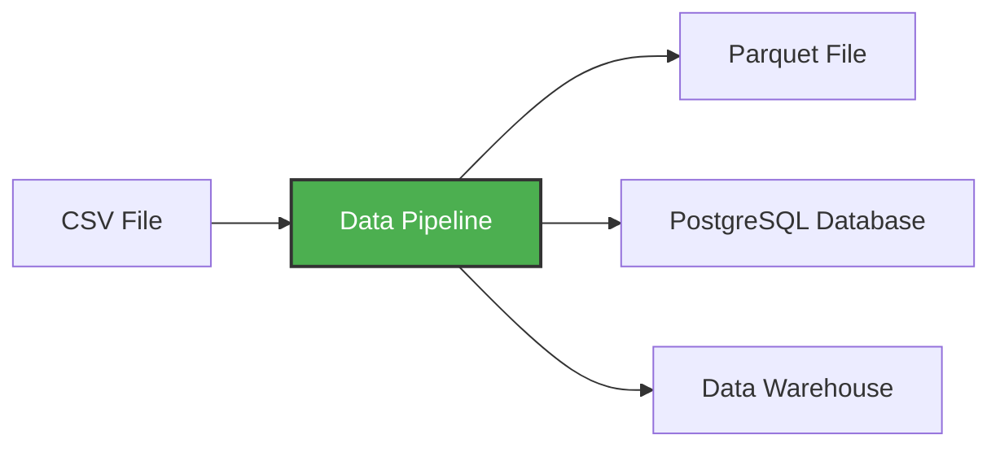

An example of pipeline below



# A simple pipeline
First, create a directory pipeline and inside, create a file `pipeline.py`:

*NOTE: Running this on first try should result in failure as you don't have pyarrow and pandas installed (installation guide below)*

```
import sys
import pandas as pd

print("arguments", sys.argv) 

day = int(sys.argv[1]) 
# input when running code

df = pd.DataFrame({"A": [1, 2], "B": [3, 4]})
print(df.head())

df.to_parquet(f"output_day_{sys.argv[1]}.parquet")

print(f"Running pipeline for day {day}")

```

## To install dependecies for `pipeline.py`
```
pip install pandas pyarrow
```

# Using uv - Modern Python Package Manager
```
pip install uv
```

## initializing python project with uv (package installer), this will create `pyproject.toml` file:
```
uv init --python=3.13
```

## To add dependencies with uv
``` 
uv add pandas pyarrow
```

# Finally run the below pipeline in uv
```
uv run python pipeline.py 10
```
